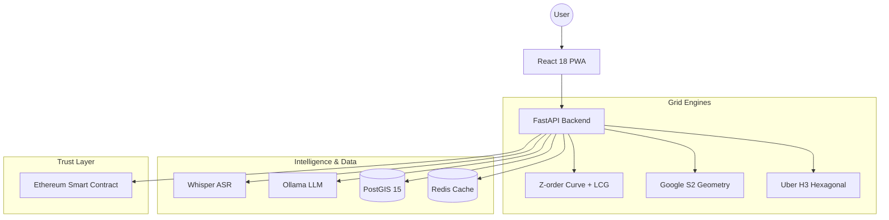

<p align="center">
  <h1 align="center">🌍 WordAddress</h1>
  <p align="center">
    <strong>Open-source three-word location encoding for the entire planet.</strong>
  </p>
  <p align="center">
    
    
    
    
    
  </p>
  <p align="center">
    <a href="#-quick-start">Quick Start</a> &bull;
    <a href="#-features">Features</a> &bull;
    <a href="#-architecture">Architecture</a> &bull;
    <a href="#-api-guide">API Guide</a> &bull;
    <a href="DEVELOPMENT_GUIDE.md">Full Guide</a>
  </p>
</p>

---

**WordAddress** converts any GPS coordinate into a memorable three-word address (e.g., `///forest.morning.river`) with **3.5m precision**. It's a privacy-first, open-source alternative to proprietary geocoding systems.

### ✨ Why WordAddress?
- 🚀 **Performant**: Built with FastAPI and React 18 for sub-millisecond encoding.
- 🧠 **AI-Native**: Includes self-hosted Whisper ASR and Ollama (phi3:mini) for natural language location parsing.
- ⛓️ **On-Chain**: Integrated Ethereum/Solidity "Proof of Location" for tamper-proof attestation.
- 🔌 **Offline-First**: PWA support with background sync and IndexedDB caching.

---

### 🏗 Architecture



---

### 🚀 Quick Start

Get the full stack (Web, API, DB, Cache, AI) running in seconds:

```bash
git clone https://github.com/freakyyirus/WordAddress.git
cd WordAddress
cp .env.example .env
docker compose up --build
```

- **Web UI**: http://localhost:3000
- **API Docs**: http://localhost:8000/docs
- **LLM Setup**: `docker exec wordaddress-ollama ollama pull phi3:mini`

---

### 🛠 Tech Stack

| Component | Technology | Purpose |
| :--- | :--- | :--- |
| **Backend** | Python 3.11, FastAPI | High-performance async API |
| **Frontend** | React 18, MapLibre GL | Interactive mapping & PWA |
| **Storage** | PostGIS, Redis | Spatial data & LRU caching |
| **AI/Voice** | Whisper, Ollama | Voice-to-location & NLP |
| **Web3** | Solidity, Web3.py | On-chain Proof of Location |

---

### 📖 API Guide

<details>
<summary><b>Click to expand Core Endpoints</b></summary>

| Method | Path | Description |
| :--- | :--- | :--- |
| `GET` | `/encode` | GPS → Word Address (`?lat=...&lon=...`) |
| `GET` | `/decode` | Word Address → GPS (`?code=...`) |
| `POST` | `/ai/parse-location` | Natural language → Coordinates |
| `POST` | `/blockchain/submit-proof` | Register location on Ethereum |

</details>

<details>
<summary><b>Example Usage</b></summary>

```bash
# Encode a location
curl "http://localhost:8000/encode?lat=51.52&lon=-0.19"

# Result: {"words": "forest.morning.river", "precision": 3.48}
```
</details>

---

### 📈 Project Roadmap

- [x] **Phase 1**: Core Z-order/LCG grid & Wordlist generation.
- [x] **Phase 2**: S2/H3 alternative grids and LFSR scrambling.
- [x] **Phase 3**: AI Assistant & Voice integration.
- [x] **Phase 4**: PWA, AR Navigation, and Blockchain Proof-of-Location.
- [ ] **Phase 5**: Mobile Apps (React Native) & SDKs.

---

### 🤝 Contributing

We welcome contributions! See our [DEVELOPMENT_GUIDE.md](DEVELOPMENT_GUIDE.md) for local setup, testing strategies, and system internals.

---

<p align="center">
  Built with ❤️ for an open world.
</p>
